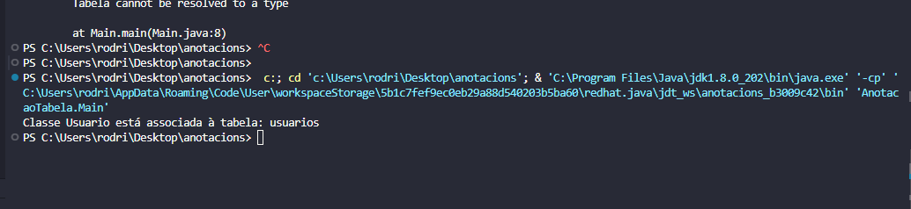

<!DOCTYPE html>
<html lang="pt-br">
<head>
    <meta charset="UTF-8">
    <meta name="viewport" content="width=device-width, initial-scale=1.0">
    <meta name="description" content="Projeto Java: Utilização da Anotação @Tabela">
    <meta name="keywords" content="Java, Anotação, @Tabela, Projeto">
    <meta name="author" content="Ana Alice Rodrigues">
    <title>Projeto Java: Utilização da Anotação @Tabela</title>
</head>
<body>

<header>
    <h1>Projeto Java: Utilização da Anotação <code>@Tabela</code></h1>
    
</header>

    
Índice

    <ol>
        <li><a href="#sobre-o-projeto">Sobre o projeto</a></li>
        <li><a href="#parte-tecnica">Parte Técnica</a></li>
        <li><a href="#estrutura-dos-arquivos">Estrutura dos Arquivos</a></li>
        <li><a href="#casos-de-uso">Casos de Uso</a></li>
        <li><a href="#ferramentas">Ferramentas</a></li>
        <li><a href="#contato">Contato</a></li>
    </ol>

<section id="sobre-o-projeto">
    <h2>Sobre o projeto</h2>
    
Este projeto demonstra o uso de anotações personalizadas em Java, especificamente a anotação <code>@Tabela</code>. O objetivo é mostrar como criar, aplicar e processar anotações em classes Java. A anotação <code>@Tabela</code> é usada para associar uma classe a uma tabela de banco de dados fictícia.

    
Proposta de Valor: Facilitar a associação de metadados a classes, permitindo uma abordagem mais modular e configurável no design de software.

</section>

<section id="parte-tecnica">
    <h2>Parte Técnica</h2>
    <ul>
        <li>Backend: Implementado em Java, utilizando anotações personalizadas para associar classes a tabelas de banco de dados.</li>
        <li>Frontend: Não aplicável neste projeto.</li>
        <li>Banco de Dados: Não aplicável diretamente, mas a estrutura demonstra a associação a tabelas de banco de dados fictícias.</li>
    </ul>
</section>

<section id="estrutura-dos-arquivos">
    <h2>Estrutura dos Arquivos</h2>
    <ul>
        <li><strong>src/AnotacaoTabela/Tabela.java:</strong> Define a anotação <code>@Tabela</code> com o elemento <code>nome</code>.</li>
        <li><strong>src/AnotacaoTabela/Main.java:</strong> Contém a classe principal que verifica a presença da anotação <code>@Tabela</code> na classe <code>Usuario</code> e imprime o nome da tabela associada.</li>
        <li><strong>src/AnotacaoTabela/Usuario.java:</strong> Anota a classe <code>Usuario</code> com <code>@Tabela</code>, associando-a à tabela "usuarios".</li>
    </ul>
</section>

<section id="casos-de-uso">
    <h2>Casos de Uso</h2>
    <ul>
        <li>Demonstrar como criar e aplicar anotações personalizadas em Java.</li>
        <li>Facilitar a associação de classes Java a tabelas de banco de dados de forma modular e configurável.</li>
    </ul>
</section>

<section id="ferramentas">
    <h2>Ferramentas</h2>
    <ul>
        <li></li>
        <li></li>
        <li></li>
        <li></li>
    </ul>
</section>

<section id="contato">
    <h2>Contato</h2>
    <ul>
        <li></li>
    </ul>
    
Este projeto foi desenvolvido por Ana Alice Rodrigues. Para mais informações, acesse o perfil no Linktree.

</section>

</body>
</html>
